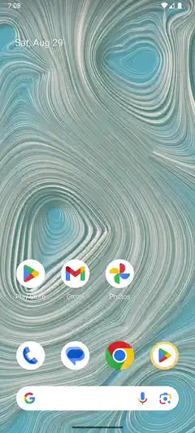
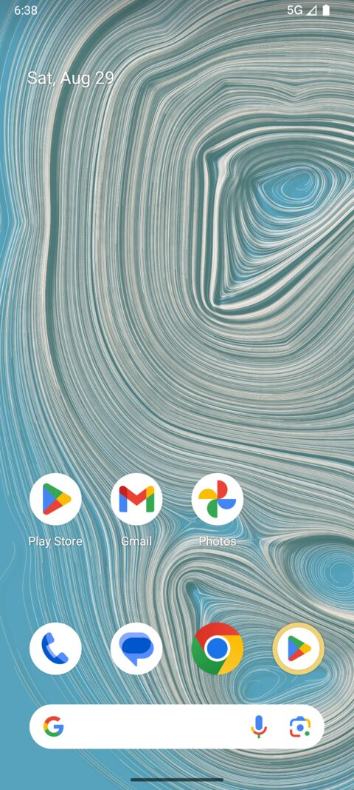
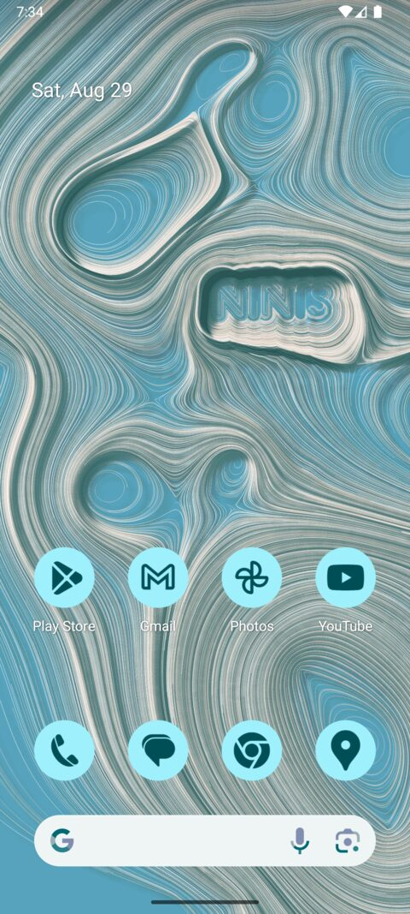
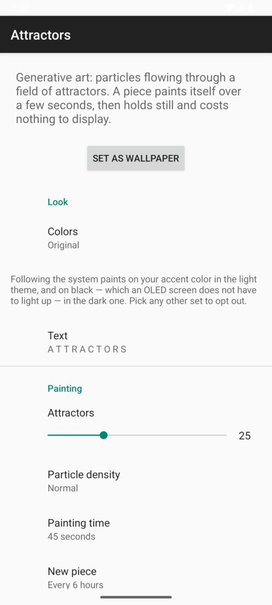

# Attractors — Android live wallpaper

A native Android port of [attractors](https://github.com/steren/attractors)
([attractors.steren.fr](https://attractors.steren.fr)): generative art made of particles
flowing through a field of attractors.

A piece paints itself over about a minute, then holds still. It does not loop, it does not
breathe, it does not animate behind your apps — once it has finished painting, the
wallpaper costs nothing at all to display. It is painted a third wider than the screen, so
it slides behind the home screen as you page across it, the way a photo does.

A piece painting itself, sped up:



The same thing at full length and quality, ending on the home screen paging so that the
wallpaper can be seen sliding behind it: [painting.mp4](docs/painting.mp4). GitHub does not
play a video held in a repository, so it has to be downloaded to watch.

| Light theme | Dark theme | With text |
|---|---|---|
|  |  |  |

All three follow the system, on a device that takes its theme from the wallpaper: the piece
brings the colors of the web version, on plain black in the dark theme. The third has
`NINIS` set as the text.

## Building and installing

The build needs a JDK 17 or newer:

```sh
export JAVA_HOME=/path/to/jdk        # e.g. ~/.local/share/jdks/jdk-21.0.12.1+1
./gradlew installDebug
```

Then pick *Attractors* from the wallpaper picker: long press the home screen, or Settings →
Wallpaper & style. There is no icon in the app drawer, because there is no app — this is a
wallpaper and nothing else. To go straight to its preview:

```sh
adb shell am start -a android.service.wallpaper.CHANGE_LIVE_WALLPAPER \
  --ecn android.service.wallpaper.extra.LIVE_WALLPAPER_COMPONENT \
  fr.steren.attractors/.AttractorsWallpaperService
```

## Releases

Publishing a GitHub release builds the release APK and attaches it to that release, via
`.github/workflows/release-apk.yml`. A release tagged `v1.4.2` produces
`attractors-1.4.2.apk`. The workflow can also be run by hand, with a tag to rebuild and
re-attach that release's APK, or without one to just build.

To get a signed APK — and an unsigned one cannot be installed — add four repository
secrets. Generate a key once:

```sh
keytool -genkeypair -v -keystore upload.jks -alias upload \
  -keyalg RSA -keysize 2048 -validity 10000
base64 -w0 upload.jks        # the value of KEYSTORE_BASE64
```

| Secret | |
|---|---|
| `KEYSTORE_BASE64` | The keystore, base64 encoded |
| `KEYSTORE_PASSWORD` | Its password |
| `KEY_PASSWORD` | The key's own password |

The alias is not a secret — it is `upload` in the workflow, and it is in the certificate of
every APK regardless.

Keep `upload.jks` somewhere safe and out of the repository: Android identifies an app by
the key it was signed with, so losing it means no one who installed an earlier build can
upgrade. Without these secrets the workflow still runs, and attaches an APK named `-unsigned` along
with a warning, rather than something that looks installable and is not — Android refuses
to install an unsigned APK, from any source.

The same environment variables drive a local release build:

```sh
KEYSTORE_FILE=upload.jks KEYSTORE_PASSWORD=... KEY_ALIAS=upload KEY_PASSWORD=... \
  VERSION_NAME=1.4.2 VERSION_CODE=10402 ./gradlew :app:assembleRelease
```

## How it is put together

| | |
|---|---|
| `AttractorPiece` | The piece itself: the field, the particles, and the bitmap they paint |
| `AttractorsWallpaperService` | The `WallpaperService`, its render loop and its lifecycle |
| `PieceConfig` / `Palette` | What a piece looks like, and where the colors come from |
| `Settings` | The user's choices, read once and re-read only when they change |

Around 1400 lines of Kotlin. No Compose, and no dependency beyond `core-ktx` and
`preference-ktx`; the release APK is under a megabyte.

## What was ported

`AttractorPiece` is a port of `attractors.js`. The field, the movement of the particles,
the seeding, the trails, the shadows and the way the text bends the field around itself
all follow the original, so a piece rendered here looks like one the web page renders with
the same settings.

Two things needed reworking rather than translating:

**Shadows come to rest instead of piling up to black.** The web version stamps a nearly
transparent black onto an 8 bit canvas, and the rounding of that canvas is what stops the
shadows: a channel darkens by one step for as long as `shadow_opacity * channel` rounds up
to 1, so it comes to rest at `0.5 / shadow_opacity` and never goes below, and a channel
already darker than that never moves at all — which is why a dark background takes no
shadows. Skia rounds the other way, and the very same stamps take an area all the way to
black. So the limit is made explicit here: shadows are painted in the color the web version
comes to rest on, at the alpha that walks there at about one 8 bit step per stamp.

**A dark piece gets that layer the other way up.** With no shadows, a piece on black is
bare trails with nothing between them. The trails are 0.35 pixels wide, so at a phone's
pixel density the gaps between them are single pixels of pure black against a bright trail
— the sharpest edge a screen can draw, repeated across the whole piece, which the eye reads
as grain. On a background too dark to darken, the same layer is therefore painted upwards
instead: the piece's own two colors, averaged and dimmed to a tenth of their brightness, so
it reads as the same material rather than as fog. It goes exactly where the shadows would
have gone, so the empty areas of a piece stay at true black and a panel still has nothing
to light there. Measured over a screenshot, it takes the single-pixel speckle from 2.8% of
the piece to 0.7%. A background with no room to darken that is still lighter than the wash
— `forest` — is left alone, as it is on the web.

**Text outlines come from the platform.** The web version walks the path commands
opentype.js hands it. Here the outline comes from Android's own text engine, and
`PathMeasure` flattens each contour into the segments that become attractors. The font,
CamBam Stick, is the same one the web page uses. A string too long for a phone is shrunk to
fit rather than run off both edges.

Not ported: the two characters the library draws itself, `▲` and `⬣`, and the no-go zones —
both exist for the page's layout, which a wallpaper does not have.

## Colors

By default the wallpaper follows the system. In the light theme it paints on the accent
Android derives from your home screen; in the dark theme the background is plain black, so
the trails, and the faint wash that separates them, are the only thing an OLED panel has to
light up, and they are mid tones of the accent rather than pale ones. What makes the original piece easy to live behind is that its
trails are only a little lighter than what they are painted on, and against black, pale
trails are anything but.

Flipping the device between light and dark repaints the piece: right away if it is being
looked at, and otherwise the next time the wallpaper is shown, since the theme can just as
easily flip while the service is not running to hear about it. Picking any other set of
colors in the settings opts out of all of it; `Original` is the palette of the web page.

`Follow the system` has two sides to it, because Android derives its accent either from a
color the user picked outright or from the wallpaper itself, and the wallpaper cannot
follow something that is derived from the wallpaper:

- **The accent is a color you picked.** The piece follows it, and publishes nothing.
- **The accent comes from the wallpaper.** The piece cannot follow it, so it brings its own
  colors — the ones of attractors.steren.fr — and hands them to the system for the accent
  to be derived from.

Either way one side leads and the other follows, the loop never closes, and the piece
always has a color to paint with. Which of the two it is comes from the setting the theme
picker writes, `theme_customization_overlay_packages`; a device without it is read as
taking its colors from the wallpaper, which is the default.

Every palette other than `Follow the system` is chosen outright, so all of them publish
their colors, and a device taking its theme from the wallpaper themes itself to match the
piece.

## Battery

Everything about the design is about doing nothing most of the time.

- **A piece finishes.** After the configured painting time the render loop is torn down.
  There is then no thread, no frame and no timer: measured at zero CPU. That is the state
  the wallpaper is in for almost all of its life. The default is 45 seconds of painting and
  a new piece every 6 hours — about three minutes of work a day.
- **Nothing is painted while it cannot be seen.** `onVisibilityChanged` stops the loop, so
  no frame is ever drawn behind an app, a lock screen or a dark screen.
- **A finished piece is kept on disk** and comes back after a reboot, or after the system
  reclaims the service, for one file read instead of a repaint.
- **Paging the home screen paints nothing.** A piece is painted a third wider than the
  screen once, and paging only changes which part of it is copied across, so the parallax
  costs a copy and never a repaint. The extra third is the whole price of it: a third more
  pixels to paint on while a piece is being painted, and a third more memory to hold it.
- **Nothing runs in the background.** No alarm, no job, no wake lock, no broadcast
  receiver. Whether a new piece is due, and whether the theme has moved out from under the
  one on screen, are both worked out when the wallpaper becomes visible, which is the only
  moment either could matter.
- **A frame allocates nothing.** Positions, segments and shadow centers all live in
  primitive arrays allocated once, so painting never wakes the garbage collector.
- **A frame is three draw calls.** One `drawLines` per color for every trail of the frame,
  and one `drawPoints` for every shadow, rather than a call per particle.
- **The field skips what it cannot show.** An attractor more than three standard deviations
  away is worth one ten-thousandth of its weight at its center, so it is dropped before the
  square root and the exponential are paid for. What is left of the exponential is a table
  lookup — the field is normalized right after, so the error cannot reach the screen.
- **Frames are decoupled from the painting.** The frame rate only decides how often the
  piece reaches the screen. A long gap between frames is cut into short steps rather than
  clamped, so a piece takes the same time to paint whether it is watched at 60 frames per
  second or at 4. Copying a screenful of pixels is what a frame costs most — three and a
  half times the simulation, measured — so showing fewer of them is close to a straight
  saving. It is also why battery saver simply stretches the frame interval: the piece still
  finishes on time, it is just watched less often.
- **The copy to the screen goes through the GPU**, via `lockHardwareCanvas`, and the piece
  is marked opaque so that it needs no blending.

## Settings

Reachable from the gear in the wallpaper picker, which is the only screen the app has.

| | |
|---|---|
| Colors | Follow the system, one of five fixed palettes, or a new random one per piece |
| Text | Particles flow around it. Empty by default |
| Attractors | How many, 3 to 80 |
| Particle density | Sparse, normal or dense |
| Painting time | How long a piece paints before it holds still |
| New piece | Every time the wallpaper is shown, hourly, every 6 hours, daily, or only on a double tap |
| Double tap to repaint | Double tap the home screen for a new piece |
| Frame rate | 15, 30 or 60 frames per second while a piece paints |
| Slow down in battery saver | Show fewer frames while the device is saving power |



## License

The port follows the license of the original project. `1CamBam_Stick_2.ttf` is the font
shipped with it.
